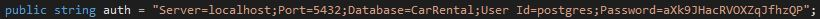
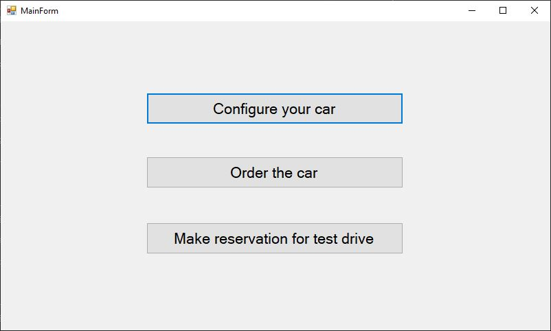
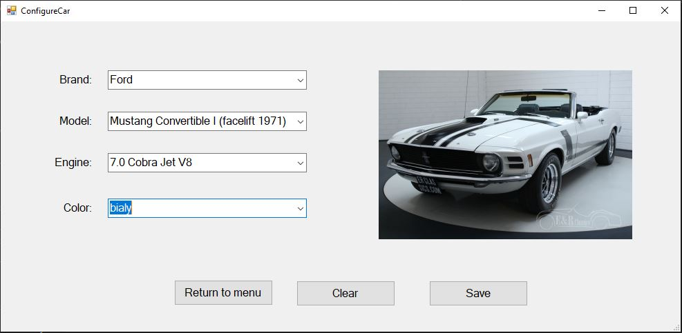
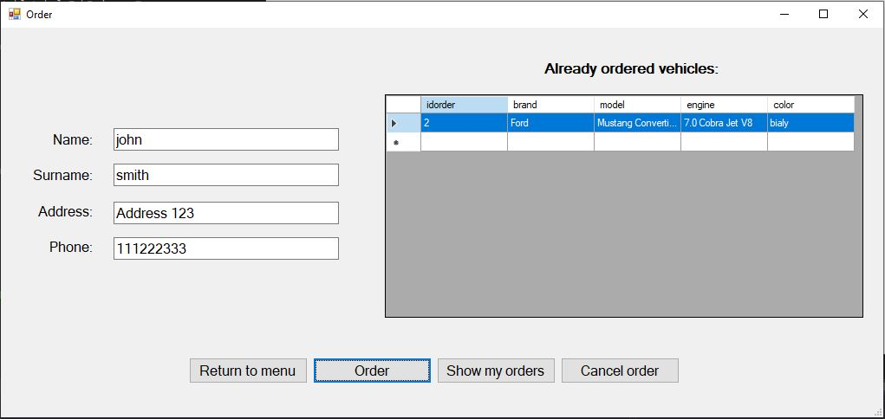

## CarRental project

__Goal:__ Create an application that provides configuring a car, ordering it and reservating test drive. 
__Brief description:__ App is divided into 4 forms: MainForm, ConfigureCarForm, OrderForm and TestDriveReservationForm. 
Each form handles one functionality. __Data persistence__ is realised by PostgreSQL database. Database schema is located in '/resources/CarRental_script.sql'.  
App will work only if you configure your database properly. To make that happen, follow those steps: 
1. Create new database.
2. Run the script (/resources/CarRental_script.sql)
3. To provide necessary information (server, user etc.) open '/src/DatabaseConnection.cs' and edit 'auth' attribute, eg.: 
  

__GUI:__  
 
 
 

